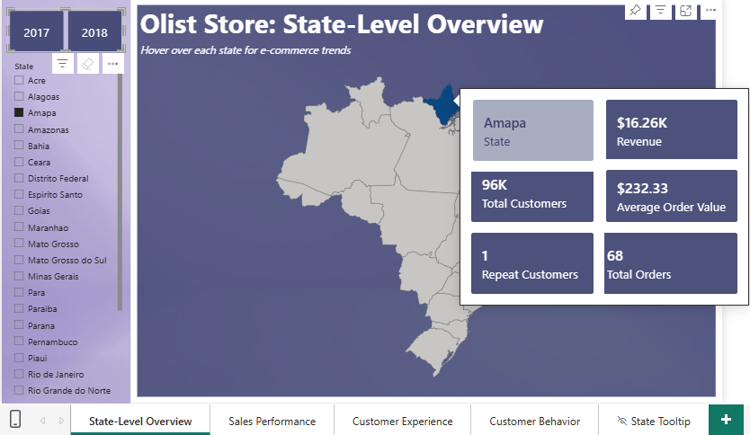
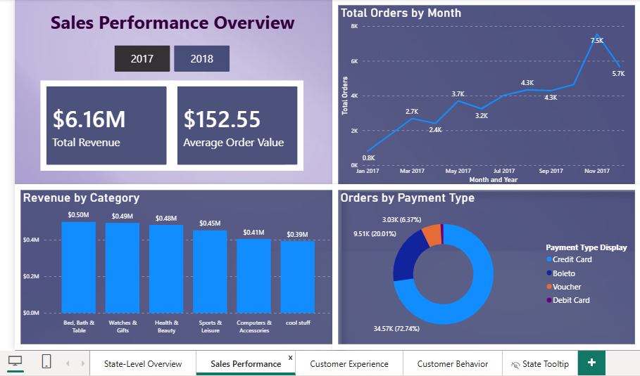
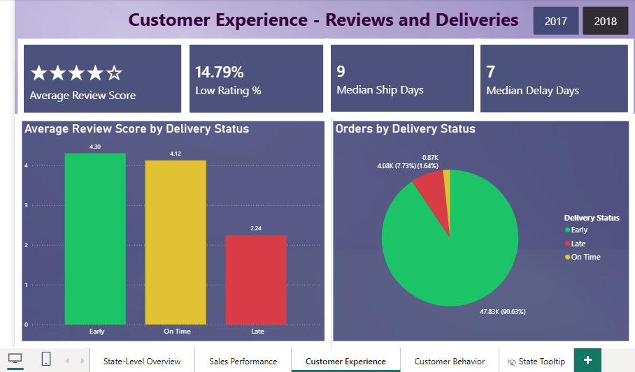
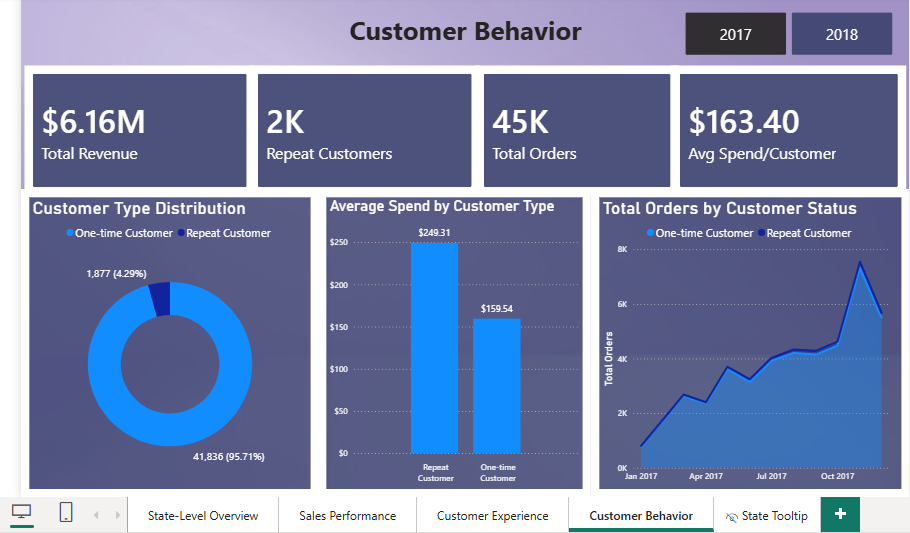

# Olist E-Commerce Analytics Dashboard (Power BI)
Overview of Olist Store (Brazil-based platform) e-commerce metrics, including state-level performance, sales trends, customer experience, and behavioral analysis.

## Overview
This dashboard explores:
- Regional/state-level revenue performance
- Revenue and sales trends
- Customer satisfaction and delivery experience
- Repeat vs single-purchase customer behavior

## Tools Used
- Power BI
- DAX
- Power Query
- Data Modeling

## Dashboard Pages
1. State-Level Overview  
2. Sales Performance  
3. Customer Experience  
4. Customer Behavior  

## Key Insights
- Majority  of order volume concentrated in small number of states
- Order volume accelerated sharply toward end of year 
- Delivery delays correlated with lower review scores
- Repeat customers showed higher lifetime value

## Screenshots

## Files
- `Olist_Store_E-Commerce_Report.pbix` (available on request)

## About the Dataset
Public Brazilian e-commerce dataset from Olist retrieved from Kaggle (https://www.kaggle.com/datasets/olistbr/brazilian-ecommerce)
